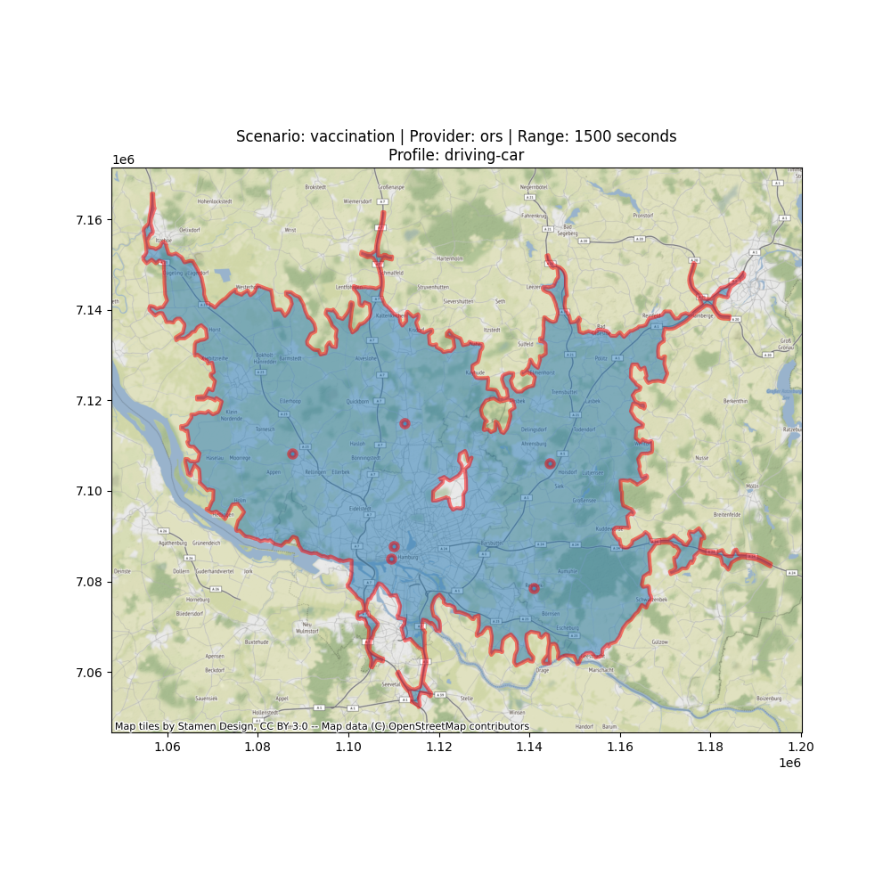
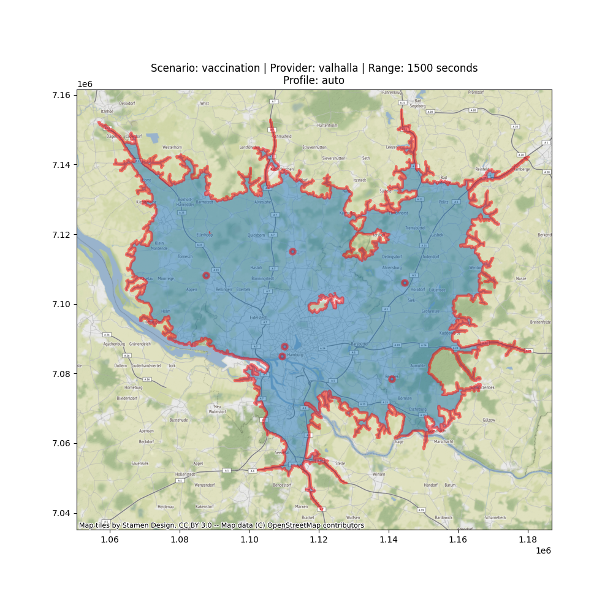
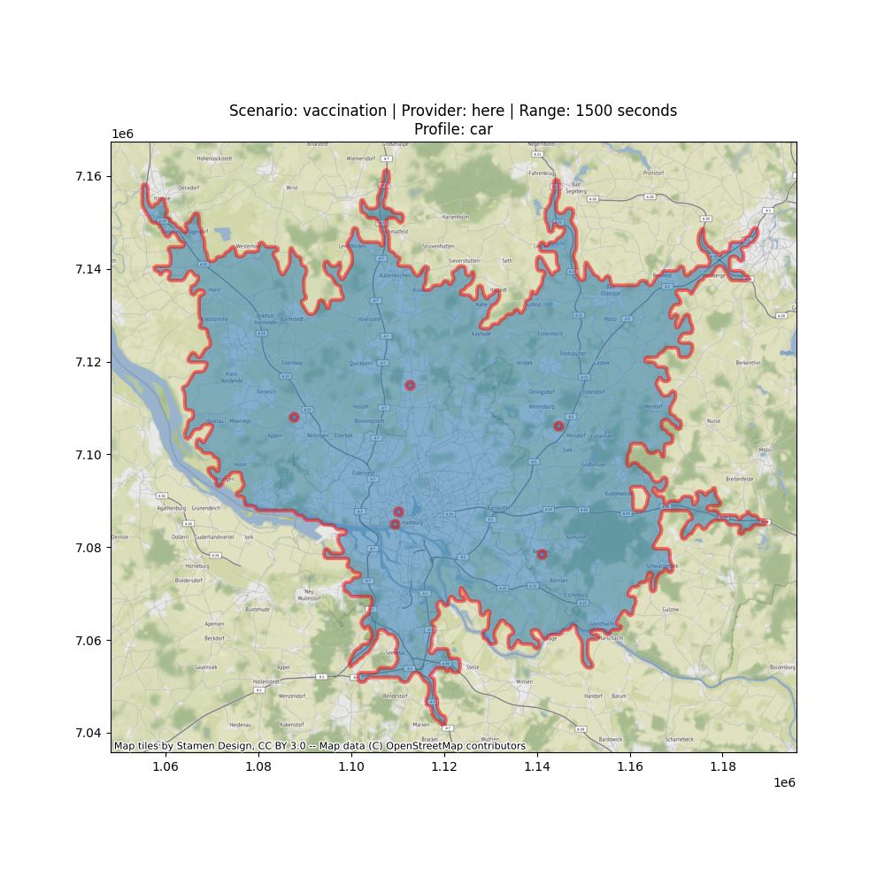
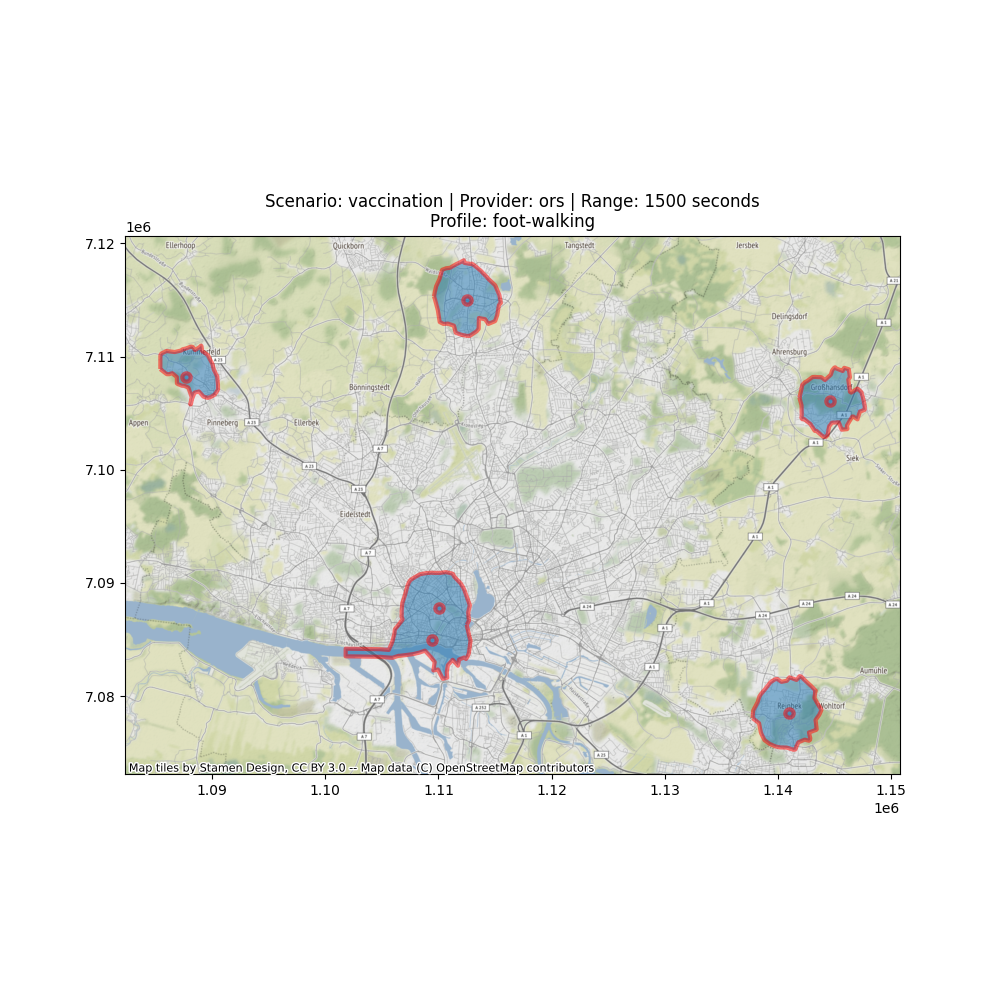
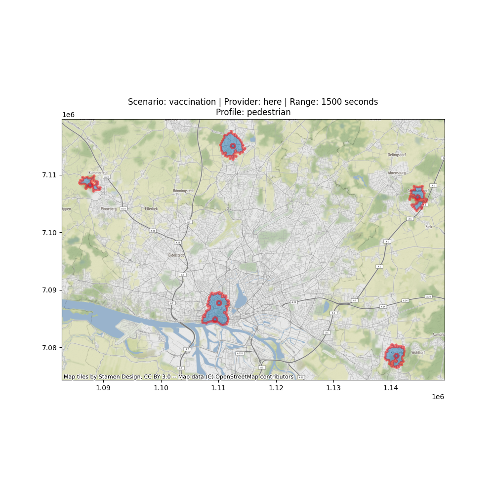
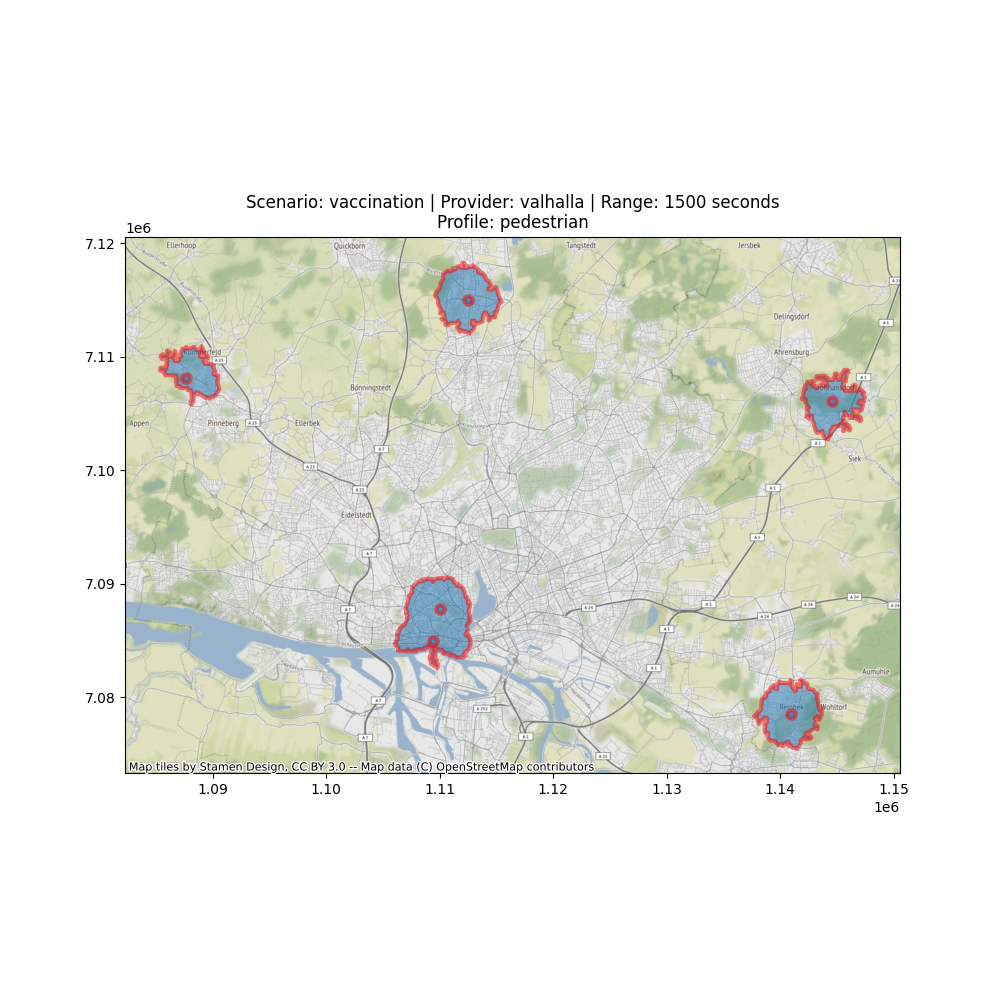

# Yact

`Yet Another Cactus`. Gives you functionality you never knew you could need. Enjoy!
<!-- TOC depthFrom:1 depthTo:4 withLinks:1 updateOnSave:0 orderedList:0 -->
- [Dependencies](#dependencies)
- [Installation](#installation)
  * [Install Poetry Unix/Linux](#install-poetry-unix-linux)
  * [Install Yact](#install-yact)
- [Providers](#providers)
- [Scenarios](#scenarios)
  * [Vaccination](#vaccination)
- [Usage](#usage)
  * [Positional arguments](#positional-arguments)
  * [Input file format '-s', '--scenario'](#input-file-format---s------scenario-)
  * [Kernel size '-p', '--provider'](#kernel-size---p------provider-)
  * [Number of concurrent threats '-f' ,'--profile'](#number-of-concurrent-threats---f------profile-)
  * [Processing algorithm '-k', '--apikey'](#processing-algorithm---k------apikey-)
  * [Processing algorithm '-b', '--bbox'](#processing-algorithm---b------bbox-)
  * [Processing algorithm '-r', '--ranges'](#processing-algorithm---r------ranges-)
  * [Processing algorithm '-t', '--rangetype'](#processing-algorithm---t------rangetype-)
  * [Execution example:](#execution-example-)
<!-- /TOC -->

## Dependencies

- Linux | Preferably Ubuntu 20.04/18.04. It should run on any Linux that runs GDAL
- Windows
- Python >=3.7.1
- pip3
- GDAL: https://mothergeo-py.readthedocs.io/en/latest/development/how-to/gdal-ubuntu-pkg.html

## Installation

### Install Poetry Unix/Linux

```shell script
curl -sSL https://raw.githubusercontent.com/python-poetry/poetry/master/get-poetry.py | python -
```

### Install Poetry Windows
Open windows `powershell` and run the following:
```shell
(Invoke-WebRequest -Uri https://raw.githubusercontent.com/python-poetry/poetry/master/get-poetry.py -UseBasicParsing).Content | python -
```
Make sure `python` is installed. After the installation add `%USERPROFILE%\.poetry\bin` to your path.
Make sure to have `GDAL` installed!

### Install Yact (linux)

Clone and install locally:

```shell script
# Create and activate virtual env, e.g.
python -m venv .venv
source .venv/bin/activate
poetry install --no-dev

```
### Install Yact (windows)

Clone the repo. Open `powershell`:

```shell script
Set-ExecutionPolicy -ExecutionPolicy Unrestricted -Scope CurrentUser
python -m venv .venv
.\.venv\Scripts\Activate.ps1
poetry install --no-dev

```

See `Usage` or `examples` for more details.


## Providers

`Yact` supports three providers:

```shell
- valhalla (Open-Source)
- ors (Open-Source)
- here (Closed-Source/Proprietary)
```

The main goal is to achieve comparability among routing APIs from open-source projects.
To have a reference from a routing engine, that is based on quality road data, `here` has been integrated.
This gives the opportunity to back test results from free open-source projects based on OSM data, with results from data that was collected
and prepared under paid market conditions.

## Scenarios

Yact supports the following scenarios:

```shell
- vaccination
- ...
```

### Vaccination

The `vaccination` scenario queries possible vaccination locations from the OHSOME API and calculates isochrones from
each location. The isochrones represent a theoretical spatial coverage for vaccinations. The irochrones can be
calculated using distance or time. For the `valhalla` routing engine only time is possible since distance is only
implemented in the OpenRouteService engine.

- When using `OpenRouteService` the population size inside the isochrones is included. The data is derived from
  the `GHSL - Global Human Settlement Layer` from [https://ghsl.jrc.ec.europa.eu](https://ghsl.jrc.ec.europa.eu).
- The OHSOME Base query is: `healthcare:speciality=vaccination or vaccination=covid19 or healthcare=vaccination_centre`.

Example Results:

| Query command                                                                                                          | Description                                                                                | Results                                                                                         |
|------------------------------------------------------------------------------------------------------------------------|--------------------------------------------------------------------------------------------|-------------------------------------------------------------------------------------------------|
| yact ./output -v info -s vaccination -p ors -f car -r 1500 -t time -b 9.6441,53.3893,10.366,53.7152 -k ***             | Vaccination scenario with 1500 seconds reachability for car using OpenRouteService.        |                  |
| yact ./output -v info -s vaccination -p valhalla -f car -r 1500 -t time -b 9.6441,53.3893,10.366,53.7152 -k ***        | Vaccination scenario with 1500 seconds reachability for car using Valhalla.                |                      |
| yact ./output -v info -s vaccination -p here -f car -r 1500 -t time -b 9.6441,53.3893,10.366,53.7152 -k ***        | Vaccination scenario with 1500 seconds reachability for car using proprietary Here.                |                      |
| yact ./output -v info -s vaccination -p ors -f pedestrian -r 1500 -t time -b 9.6441,53.3893,10.366,53.7152 -k ***      | Vaccination scenario with 1500 seconds reachability for pedestrian using OpenRouteService. |          |
| yact ./output -v info -s vaccination -p valhalla -f pedestrian -r 1500 -t time -b 9.6441,53.3893,10.366,53.7152 -k *** | Vaccination scenario with 1500 seconds reachability for pedestrian using Valhalla.         |  |
| yact ./output -v info -s vaccination -p here -f pedestrian -r 1500 -t time -b 9.6441,53.3893,10.366,53.7152 -k *** | Vaccination scenario with 1500 seconds reachability for pedestrian using Valhalla.         |  |

## Usage

After installation, `yact` can be called from the commandline as executable:

```bash
yact --help
yact --version
```

or:

```bash
python yact_runner.py --help
python yact_runner.py --version
```

### Positional arguments

There is 1 positional arguments for `yact`:

1. `outputFolder` (string): The output folder the files will be written to.

### Input file format '-s', '--scenario'

Provide the scenario to calculate.

```text
- vaccination
```

### Kernel size '-p', '--provider'

Choose the provider as the base for routing and isochrone calculation. Possible choices:

```shell
- valhalla (via MapBox API)
- ors (via OpenRouteService API)
- here (via Here API)
```

The provider uses the fixed public APIs of mapbox and HeiGIT/ORS. For the source code see:

- Valhalla Routing: https://valhalla.readthedocs.io/en/latest/api/
- ORS Routing: https://openrouteservice.org/dev/#/api-docs
- Here Routing: https://developer.here.com/

### Number of concurrent threats '-f' ,'--profile'

Choose the desired routing/isochrones profile. Possible choices:

```shell
- car
- pedestrian
```

### Processing algorithm '-k', '--apikey'

Provide a proper api key for the providers.

- ORS API Key can ba obtained from:

```shell
https://openrouteservice.org/dev/#/signup
```

- Valhalla (MapBox API) key can be obtained from:

```shell
https://account.mapbox.com/access-tokens/
```

Both APIs offer some free quotas which is enough to test this tool.

### Processing algorithm '-b', '--bbox'

Provide a bounding box to query the scenarios for.

Default: 8.67066,49.41423,8.68177,49.4204

### Processing algorithm '-r', '--ranges'

Provide ranges for the isochrones in seconds.

Defaults to: 100 seconds

### Processing algorithm '-t', '--rangetype'

Provide the range type for isochrones. For valhalla only `time` is valid.

Default: `time`

```shell
- time
- distance
```

### Execution example:

To run the example `cd` into the root folder of the repository:

```shell
yact ./output -v info -s vaccination -p valhalla -f car -r 1500 -t time -b 9.6441,53.3893,10.366,53.7152 -k [YOUR_KEY_FROM_MAPBOX]
yact ./output -v info -s vaccination -p ors -f car -r 1500 -t time -b 9.6441,53.3893,10.366,53.7152 -k [YOUR_KEY_FROM_ORS]
yact ./output -v info -s vaccination -p here -f car -r 1500 -t time -b 9.6441,53.3893,10.366,53.7152 -k [YOUR_KEY_FROM_HERE]
```

This will process the test data files from `tests/data`. Feel free to input any raster data in `gif`
