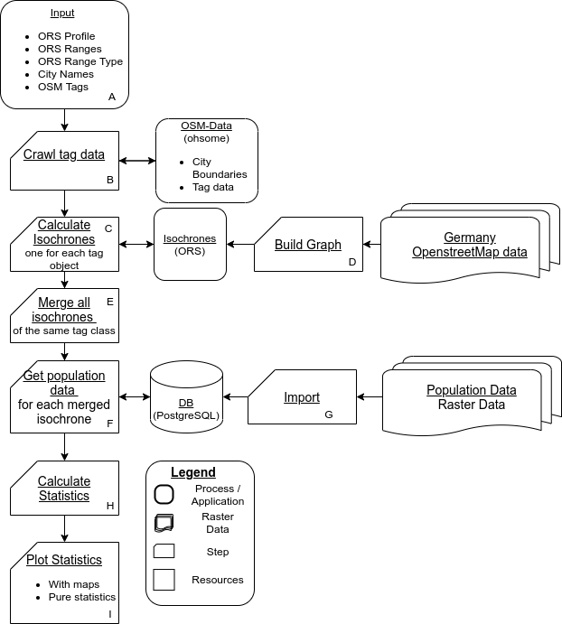

# Unrelevant Proof-of-Concept
<!-- TOC depthFrom:1 depthTo:4 withLinks:1 updateOnSave:0 orderedList:0 -->
- [Concept](#concept)
- [Dependencies](#dependencies)
- [Installation](#installation)
  * [Install Poetry Unix/Linux](#install-poetry-unix-linux)
  * [Install Unrelevant](#install-unrelevant)
- [Providers](#providers)
- [Scenarios](#scenarios)
  * [Vaccination](#vaccination)
- [Usage](#usage)
  * [Positional arguments](#positional-arguments)
  * [Input file format '-s', '--scenario'](#input-file-format---s------scenario-)
  * [Kernel size '-p', '--provider'](#kernel-size---p------provider-)
  * [Number of concurrent threats '-f' ,'--profile'](#number-of-concurrent-threats---f------profile-)
  * [Processing algorithm '-k', '--apikey'](#processing-algorithm---k------apikey-)
  * [Processing algorithm '-b', '--bbox'](#processing-algorithm---b------bbox-)
  * [Processing algorithm '-r', '--ranges'](#processing-algorithm---r------ranges-)
  * [Processing algorithm '-t', '--rangetype'](#processing-algorithm---t------rangetype-)
  * [Execution example:](#execution-example-)
<!-- /TOC -->

## Concept
**U**niversal **n**on-exclusive **r**iser (to) **e**levate **v**isualization **a**ccessibility (and) **n**escience `(Unrelevant)`. Gives you functionality you never knew you could need. Enjoy!
This tool is an extensive combination of popular open-source tools, namely openrouteservice and ohsome.
The goal is to calculate accessibility statistics towards specified osm tags combined to coherent categories by using Isochrones from different routing providers with either time or distance as a range type.
City boundaries and the osm tag data is crawled via the Ohsome API.

When using non-local based routing APIs be advised that depending on the size of the research area the amount of isochrones can easily reach five or more digits and exceed your quota without even finishing one run.

The current implementation is targeted to analyse accessibility to `Green and Recreational POIs` in cities in Germany but could easily adjusted to different target areas.
The complete workflow can be seen in the following workflow:



The complete research paper including explanations towards implementation can be found here:
[OPENSTREETMAP BASED ACCESSIBILITY ANALYSIS OF URBAN GREEN AND
RECREATIONAL SPACES BY WALKING AND CYCLING FOR TEN CITIES IN
GERMANY]( https://github.com/MichaelsJP/Unrelevant/blob/main/ugrs_research.pdf )

For example results see chapter 
## Dependencies

- Linux | Preferably Ubuntu 20.04/18.04. It should run on any Linux that runs GDAL
- Python >=3.7.1
- pip3
- GDAL: https://mothergeo-py.readthedocs.io/en/latest/development/how-to/gdal-ubuntu-pkg.html
- Population dataset in tif format for your desired spatial extent in WGS84 and a resolution of 250m from: [https://ghsl.jrc.ec.europa.eu/ghs_pop2019.php](https://ghsl.jrc.ec.europa.eu/ghs_pop2019.php)
- An osm.pbf for your desired spatial extent from: [http://download.geofabrik.de/europe.html](http://download.geofabrik.de/europe.html)
- An ohsome extract is optional. It is advised to use the public API since only the worldwide ohsome data has all the needed information to correctly return values. Download the worldwide extent from: [https://downloads.ohsome.org](https://downloads.ohsome.org)

## Installation

### Install Poetry Unix/Linux

```shell script
curl -sSL https://raw.githubusercontent.com/python-poetry/poetry/master/get-poetry.py | python -
```

### Install Unrelevant (linux)

Clone and install locally:

```shell script
# Create and activate virtual env, e.g.
python -m venv .venv
source .venv/bin/activate
poetry install --no-dev

```

See `Usage` or `examples` for more details.

### Prepare the needed data sets
First download all the needed data sets that are too big to be served in this repository:
```text
- The worldwide population data set: https://cidportal.jrc.ec.europa.eu/ftp/jrc-opendata/GHSL/GHS_POP_MT_GLOBE_R2019A/GHS_POP_E2015_GLOBE_R2019A_4326_9ss/V1-0/GHS_POP_E2015_GLOBE_R2019A_4326_9ss_V1_0.zip
- An osm.pbf for your desired spatial extent from: [http://download.geofabrik.de/europe.html](http://download.geofabrik.de/europe.html)
```
Then unzip the population data in a way that the .tif file is available.

### Prepare the docker-compose setup
After the data download prepare the `docker-compose.yml` setup:
```text
1. Replace the "./data/germany.osm.pbf" in  "- ./data/germany.osm.pbf:/ors-core/data/osm_file.pbf:ro`" with your chosen .osm.pbf.
2. If you're using a local ohsome instance uncomment the following:
#    environment:
#      DATA_FILE: "ohsome.oshdb.mv.db"
3. Replace the "ohsome.oshdb.mv.db" with the extract you downloaded.
```
### Setup script
Run the setup script:
```text
chomd +x setup.sh
./setup.sh
```
This will take care of the docker-compose setup. The bigger the population tif and osm.pbf for openrouteservice is, the longer the preparation will take.
To see individual container output you can run one of the following comands:
```text
docker logs unrelevant-ohsome-api -ft
docker logs unrelevant-ors-app -ft
docker logs unrelevant-postgres -ft
docker logs unrelevant-pgadmin4 -ft
```
### Adjust the config.ini
Before you can run the tool, the `config.ini` needs to be checked. If nothing was changed in the docker-compose setup except the steps before, it should work out of the box. Else adjust the individual parameters in the `config.ini` file.
### Tool execution
Once the setup is done, the tool is ready to be started. Run it with:
```text
source .venv/bin/activate
python runner.py -c your-config.ini
```
Depending on the size of the input data the execution can take a lot of time. Be patient ;). The results will be worth it (hopefully).

## Providers

`Unrelevant` supports three providers:

```shell
- valhalla (Open-Source)
- ors (Open-Source)
- here (Closed-Source/Proprietary)
```

The main goal is to achieve comparability among routing APIs from open-source projects.
To have a reference from a routing engine, that is based on quality road data, `here` has been integrated.
This gives the opportunity to back test results from free open-source projects based on OSM data, with results from data that was collected
and prepared under paid market conditions.

## Scenarios

Unrelevant supports the following scenarios:

```shell
- recreation
```

### Exemplary Recreational Results

The `recreation` scenario queries possible "Green and Recreational POIs" from the OHSOME API and calculates isochrones from
each location. The isochrones represent a theoretical spatial coverage for the accessibility of the surrounding population.
The population is calculated for each category based on the isochrones.
The irochrones can be calculated using distance or time. For the `valhalla` routing engine only time is possible since distance is only
implemented in the OpenRouteService engine.

- When using `OpenRouteService` the population size inside the isochrones is included. The data is derived from
  the `GHSL - Global Human Settlement Layer` from [https://ghsl.jrc.ec.europa.eu/ghs_pop2019.php](https://ghsl.jrc.ec.europa.eu/ghs_pop2019.php).
- The OHSOME Base query is: `healthcare:speciality=vaccination or vaccination=covid19 or healthcare=vaccination_centre`.

Example Results:

| Description                                                                                                       | Map Results                                                                                                                                           |
|-------------------------------------------------------------------------------------------------------------------|-------------------------------------------------------------------------------------------------------------------------------------------------------|
| Category Green Areas with 300 second Isochrones from openrouteservice with the profiles food-walking and bicycle. | **Extract from the city of Munich**:       |
| Category Historic with 300 second Isochrones from openrouteservice with the profiles food-walking and bicycle.    | **Extract from the city of Stuttgart**:  |
| Category Tourism with 300 second Isochrones from openrouteservice with the profiles food-walking and bicycle.     | **Extract from the city of Munich**:           |

| Description                                               | Statistical Results                                                                   |
|-----------------------------------------------------------|---------------------------------------------------------------------------------------|
| Count POIs absolute                                       |                                  |
| Count POIs per category                                   |             |
| Profile cycling 300 seconds results per category and city |  |
| Profile walking 300 seconds results per category and city |     |
| Profile cycling 450 seconds results per category and city |    |
| Profile walking 450 seconds results per category and city |     |


## Usage

After installation, `unrelevant` can be called from the commandline as executable:

```bash
python runner.py --help
python runner.py --version
python runner.py -c config.ini
```

### Config file parameters
The following parameters can be configured via the `config.ini` in the root folder.

### [DEFAULT]
#### Scenario
Defines the scenario, at the moment only `recreational`.
#### Provider
Defines the desired routing provider.
```shell
- valhalla (via MapBox API)
- ors (via OpenRouteService API)
- here (via Here API)
```
#### Profile
Defines the desired profile that the isochrones should be generated with.
```shell
- bicycle
- pedestrian
```
#### Range_Type
Defines the range type. For valhalla only `time` is valid.

```shell
- time
- distance
```

#### Ranges
Defines the desired range in seconds or meters, depending on `Range_Type`.
#### Output_Folder
Defines the output folder where the results should be written to.
#### Verbosity
Defines the verbosity for the command line. Default is `info`.
#### Cities
Defines the list of cities with bounding boxes for faster ohsome querying. e.g.:
```json
{
     "Berlin": "13.08835,52.33826,13.76116,52.67551",
     "Hamburg": "8.1053,53.3951,10.3253,54.0277",
     "München": "11.2809,48.0167,11.8247,48.3043",
     "Köln": "6.7725,50.8304,7.162,51.085",
     "Frankfurt am Main": "8.471825,50.015543,8.800472,50.227141",
     "Stuttgart": "9.038601,48.692019,9.31582,48.866399",
     "Düsseldorf": "6.688814,51.124375,6.939885,51.352532",
     "Leipzig": "12.236652,51.23817,12.542441,51.448114",
     "Dortmund": "7.302442,51.415525,7.638157,51.600041",
     "Essen": "6.894344,51.347571,7.13765,51.534202"
}

```
The ohsome query is `boundary=administrative and name={city_name}`. `{city_name}` stands for the iterative expansion with the names from the list.
Make sure that the city names are actual names in OSM.

#### Threads
Defines the number of threads used for certain processes. Threads
#### Tags
Defines the list of categorized tags:

```json
{
  "greenAreas": {
       "leisure":"park",
       "landuse":"grass",
       "landuse":"recreation_ground",
       "landuse":"meadow"
   },
   "water":{
       "leisure": "swimming_area",
       "natural": "beach",
       "leisure": "beach_resort",
       "water": "lake",
       "water": "reservoir",
       "water": "pond"
       },
   "historic":{
       "historic": "monument",
       "historic": "ruins",
       "historic": "castle",
       "historic": "fort",
       "historic": "memorial"
   },
   "tourism":{
       "tourism": "viewpoint",
       "tourism": "attraction",
       "natural": "peak",
       "tourism": "picnic_site",
       "leisure": "firepit",
       "amenity": "bbq",
       "amenity": "biergarten",
       "tourism": "camp_site",
       "tourism": "camp_pitch",
       "tourism": "caravan_site"
   }
}
```
### [openrouteservice]
#### URL
Define the service URL.
#### Api_Key
Define the API key for public API access. Only needed when the url ist targeted at the public openrouteservice URL.
### [Here]
#### Api_Key
### [Valhalla]
#### Api_Key
Defines the valhalla api key for the public api. Not needed when a local instance is used.
- ORS API Key can ba obtained from:

```shell
https://openrouteservice.org/dev/#/signup
```
- Valhalla (MapBox API) key can be obtained from:

```shell
https://account.mapbox.com/access-tokens/
```

#### URL
Define the service URL.
### [ohsome]
#### URL
Define the service URL.
### [postgres]
#### URL
Define the service URL.
#### Port
Define the postgresql port
#### User
Define postgresql database user.
#### Password
Define postgresql database password.
#### Database
Define postgresql database name.

### Execution example:

To run the example run from the root folder with a prepared environment:

```shell
python runner.py -c config.ini
```
Adjust the config.ini according to your needs.
